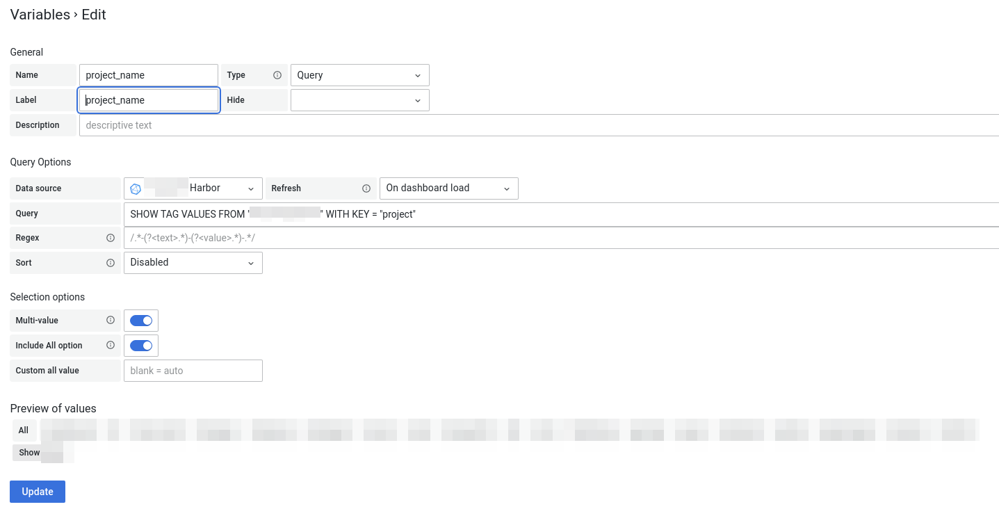
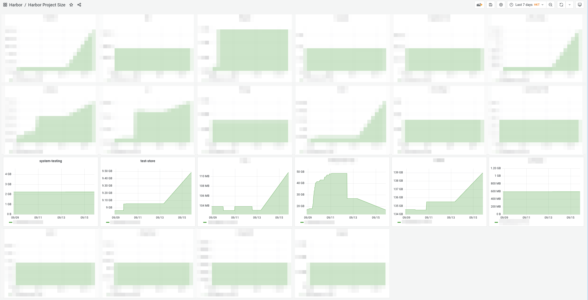

# registry-watch

> Watch your Docker registry project size, then monitor it with Grafana.

## Prerequisite

To use this tool, you will need:

* grafana
* influxdb
* python3 with influxdb lib installed

## Usage

1. Install influxdb lib with `pip install influxdb`
2. Download `registry-watch.py` from this repo and edit L8-L11 to fit your InfluxDB configuration
3. Add this to your crontab, like this: `* * * * * python3 /path/to/registry-watch.py /path/to/data/registry/docker/registry/v2`
4. Configure Grafana to use this data
    1. Set up Variables called `project_name` with query `SHOW TAG VALUES FROM <HERE_IS_YOUR_MEASUREMENT_NAME> WITH KEY = "project"`
    
    2. Set up panel with `SELECT mean("size") FROM "<HERE_IS_YOUR_MEASUREMENT_NAME>" WHERE ("project" =~ /^$project_name$/) AND $timeFilter GROUP BY time($__interval) fill(null)`, and make it repeat on `$project_name`

## Demo

